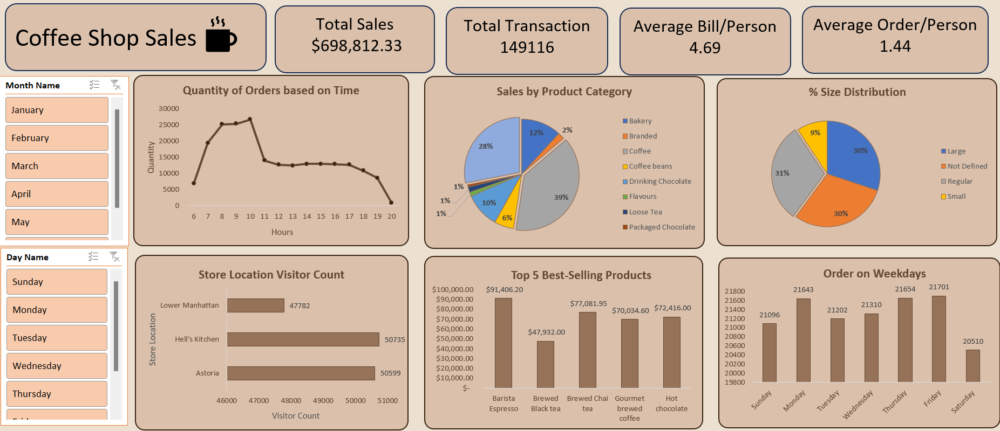

# ☕ Coffee Shop Sales Analysis

## 📌 Project Overview
This project analyzes sales data from a fictional coffee shop chain to uncover business insights, including customer behavior, product performance, and sales trends.  
The analysis was done using **Microsoft Excel** with **Power Query** for data cleaning, **Pivot Tables** for aggregation, and an **interactive dashboard** for visualization.

The goal is to demonstrate skills in **data cleaning, transformation, visualization, and business reporting** — and in future updates, this will include **Python automation** for bonus points.

---

## 🎯 Objectives
- Clean and prepare raw transactional data using **Power Query**
- Identify **total sales** and **transaction trends**
- Find **peak sales hours** and **busiest weekdays**
- Analyze **sales by product category and size**
- Highlight **top 5 best-selling products**
- Provide **actionable insights** for business growth

---

## 🗂 Dataset
- **File**: `Coffee_Shop_Sales_Analysis.xlsx`
- **Source**: Sample dataset (fictional data for learning purposes)
- **Fields include**: transaction date/time, store location, product category, unit price, quantity, etc.

---

## 🛠 Tools Used
- **Microsoft Excel**
  - **Power Query** for data cleaning & transformation  
    - Removed duplicates
    - Standardized date & time formats
    - Extracted Month, Day, Hour columns
    - Handled missing values
  - Pivot Tables & Pivot Charts for analysis
  - Slicers for interactive filtering
  - Dashboard design & formatting
- **(Planned) Python Automation**:
  - `pandas` for data processing
  - `matplotlib` / `seaborn` for visualization
  - `streamlit` for interactive dashboards

---

## 📊 Dashboard Preview

**Dashboard Features**:
- 📅 Filters for Month and Day
- ⏰ Quantity of Orders by Hour
- 🥧 Sales by Product Category & Size Distribution
- 🏪 Store Location Visitor Count
- 🏆 Top 5 Best-Selling Products
- 📈 Orders by Weekday

---

## 💡 Key Insights
1. **Peak Sales Hours**: 9 AM – 10 AM
2. **Top Product**: Barista Espresso — $91,406.20 in sales
3. **Busiest Weekday**: Friday
4. **Best-Selling Category**: Coffee (39% of total sales)
5. **Most Common Size**: Regular (31% of sales)

---

## 📂 Project Structure
